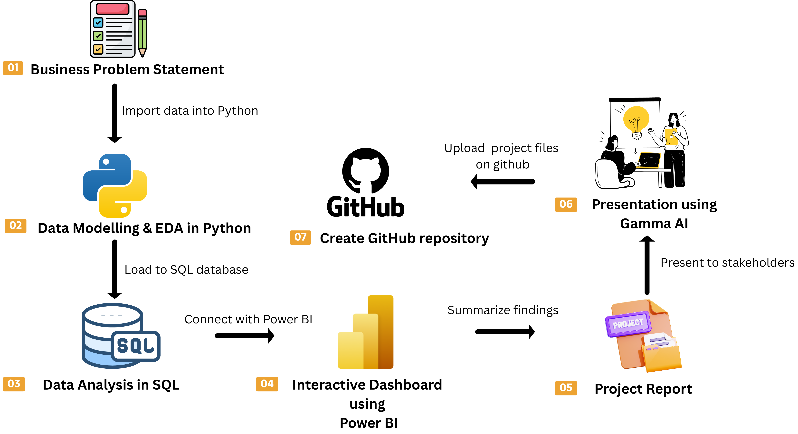

# 👨🏻‍💻 Customer Shopping Behavior Analysis | End-to-End Data Analytics Portfolio Project


This project represents a complete, industry standard, end-to-end data analytics workflow, designed to mirror the real responsibilities of professional analysts in modern business environments. The project encompasses all critical stages of data analysis, from data preparation and modeling to insight generation, visualization, and reporting.


## 🎯 Business Problem

Retail businesses collect massive amounts of customer transaction data every day. However, without proper analysis, it is difficult to identify customer purchasing patterns, high-value customer segments, product performance, and factors influencing sales.

This project aims to transform raw transactional data into actionable business insights using Python, SQL, and Power BI, enabling better decision-making for marketing, inventory management, customer retention, and revenue growth.

📌 Project Overview

The goal of this project is to simulate a corporate-grade end-to-end data analytics workflow, demonstrating the ability to translate raw data into strategic business intelligence by: 

✅ Data Preparation,Modeling & Exploratory Data Analysis (Python): Clean and transform the raw dataset for analysis. 

✅ Data Analysis (SQL): Simulate business transactions, and run queries to extract insights on customer segments, loyalty, and purchase drivers. 

✅ Visualization & Insights (Power BI): Build an interactive dashboard that highlights key patterns and trends, enabling stakeholders to make data-driven decisions. 

✅ Report and Presentation: Write a clear project report summarizing your key findings and business recommendations. Prepare a presentation that visually communicates insights and actionable recommendations to stakeholders.

## 📊 Dataset Information

- Total Records: 3,900
- Total Columns: 18
- File Format: CSV
- Source: Kaggle
- Domain: Retail Analytics

### Dataset Features

- Customer ID
- Age
- Gender
- Category
- Item Purchased
- Purchase Amount
- Review Rating
- Subscription Status
- Shipping Type
- Payment Method
- Previous Purchases
- Discount Applied
- Promo Code Used
- Location
- Season

## 🛠️ Technology Stack

| Tool | Purpose |
|-------|----------|
| Python | Data Cleaning & EDA |
| Pandas | Data Manipulation |
| NumPy | Numerical Operations |
| MySQL | Business Analysis |
| Power BI | Dashboard |
| Jupyter Notebook | Development |
| GitHub | Version Control |

## ⚙️ Project Workflow



## 🧹 Data Cleaning

Missing Value Handling

Duplicate Removal

Standardizing Columns

Feature Engineering

Creating Age Groups

Customer Segmentation

## 📈 Exploratory Data Analysis

The exploratory data analysis phase was performed to understand the dataset, identify missing values, examine feature distributions, and explore relationships between variables.

### 📄 Dataset Preview


---

### 🧹 Missing Value Analysis


---

### 📊 Product Category Distribution


---

### 🔥 Correlation Heatmap


## 🗄️ SQL Business Questions

✔ Revenue by Gender

✔ Top Rated Products

✔ Customer Segmentation

✔ Subscription Analysis

✔ Shipping Analysis

✔ Revenue by Age Group

✔ Top Products

✔ Discount Analysis

✔ Repeat Customers

✔ Average Purchase Amount

## Power BI Dashboard

Show dashboard screenshot.

## 📌 Key Business Insights

- Clothing generated the highest revenue.

- Loyal customers represented approximately 80% of the customer base.

- Subscription status had minimal impact on average purchase amount.

- Young Adults contributed the highest overall revenue.

- Heavy discounting occurred primarily on Hats, Sneakers, and Coats.

- Revenue remained relatively consistent across seasons.

## 💡 Business Recommendations

- Improve subscription benefits.

- Optimize discount strategy.

- Focus inventory on high-performing categories.

- Target loyal customers with personalized campaigns.

- Monitor customer behavior using interactive dashboards.

## Repository Structure

## 📂 Repository Structure

```text
Customer-Shopping-Behavior-Analysis
│
├── Dataset
│   └── customer_shopping_behavior.csv
│
├── Python
│   └── Customer_Shopping_Behavior.ipynb
│
├── SQL
│   └── customer_behavior_queries.sql
│
├── PowerBI
│   └── customer_behavior_dashboard.pbix
│
├── Report
│   └── Customer_Shopping_Behavior_Report.pdf
│
├── Presentation
│   └── Project_Presentation.pptx
│
├── Images
│   ├── Dashboard.png
│   ├── Workflow.png
│   └── SQL_Output.png
│
└── README.md
```
## 📚 Skills Demonstrated

- Data Cleaning

- Exploratory Data Analysis

- SQL Query Writing

- Customer Segmentation

- Business Intelligence

- Dashboard Design

- Data Visualization

- Feature Engineering

- Business Reporting

- Problem Solving

## 🚀 How to Run

1. Open the repository.

2. Install Python libraries.

3. Open Jupyter Notebook.

4. Run all notebook cells.

5. Execute SQL queries in MySQL.

6. Open the Power BI dashboard.

## 👨‍💻 Author

**Abhijit Roy**

B.Tech (Information Technology)

Aspiring Data Analyst

📧 Email: royabhijit893@gmail.com

💻 GitHub: https://github.com/AbhijitRoy893
